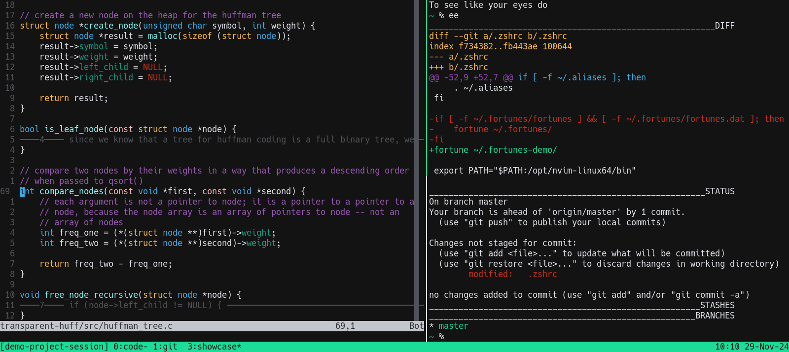

```
1. Install packages of programs that don't need to be bleeding edge.
    sudo apt install fortune-mod git ripgrep tmux xsel zsh
    (tmux should be >= 3.2 for the "copy-command" feature)
2. Install the dotfiles and set up the git repository.
    cd
    git init
    git remote add origin https://github.com/simmsbra/dotfiles
    git fetch
    git checkout --track origin/master
3. Apply the global git configuration options.
    git config --global --add include.path "~/.gitconfig-public"
4. Change the shell to zsh. (Requires a new shell or a reboot to take effect)
    chsh -s $(which zsh) $(whoami)
5. Install neovim >= 0.10.2 from pre-built binaries.
    (0.10.0 contains my folding fixes; 0.10.1 breaks when I open help)
6. Install the vim-macaroni plugin.
    cd ~/.local/share/nvim/site/pack/utilities/start
    git clone https://github.com/simmsbra/vim-macaroni
7. Install the vim-speeddating plugin.
    cd ~/.local/share/nvim/site/pack/utilities/start/speeddating
    git clone https://github.com/tpope/vim-speeddating
    mv vim-speeddating/* .
    mv vim-speeddating/.* .
    rm -r vim-speeddating
(If you open nvim inside tmux, and tmux crashes, install tmux > 3.4)
(For Wayland, install wl-clipboard instead of xsel, and check commit 46e51953f7)
```
